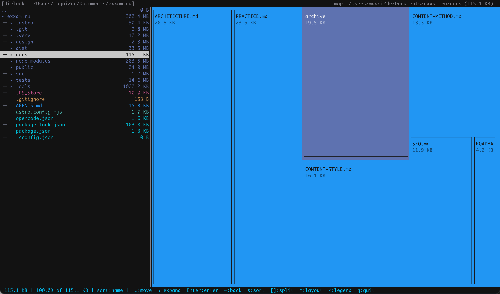

# dirlook

[](https://crates.io/crates/dirlook)
[](https://crates.io/crates/dirlook)
[](#-license)
[](#-platform-support)
[](https://github.com/magni2de/dirlook/actions/workflows/ci.yml)



`dirlook` is a fast, zero-dependency terminal disk usage analyzer written in Rust
that shows you, at a glance, where the space in a directory actually goes. Run it
on a folder and it walks the whole tree, then lays every entry out visually — the
more a folder or file takes up, the larger its block is.

Disk usage is easy to fill and hard to reason about: a couple of heavy folders
buried deep in the tree are usually the culprit, and a flat list of sizes makes
them tedious to spot. `dirlook` turns that same information into a picture you can
navigate — see which directories dominate, drill into them, and find the files
behind a bloated folder without leaving the terminal.

It shows two synchronized views of the same tree:

- a **tree** of folders and files with their sizes, and
- a **treemap** (a "data map") where every block's area is proportional to its
  size and colored by file type.

The two views share the same selection and can be arranged either **side-by-side**
(tree on the left, map on the right — the default) or **stacked** (tree on top,
map below). Press `m` to switch between them and `[` / `]` to move the divider.

No external crates and no config files: it is a single self-contained binary built
on the Rust standard library plus a small amount of POSIX FFI.

---

## ✨ Features

- **Tree view** with sizes, tree-branch guides, expand/collapse, and `Enter` to
  dive into a folder.
- **Squarified treemap** — blocks sized proportionally and colored by file type
  (images, video, audio, archives, documents, code, binaries, directories).
- **Two switchable layouts** — **side-by-side** (default) or **stacked**,
  toggled with `m`; `[` / `]` move the divider, and each layout keeps its own
  split.
- **Color legend** toggled with `/`.
- **Live, interactive scan** — the listing appears immediately and sizes are filled
  in from the background, so you can keep navigating, expanding and entering folders
  while the scan runs. Unknown sizes show a spinner in the tree and pale `?` blocks
  in the map.
- **Parallel scan** — a worker pool scans the tree concurrently, prioritizing the
  directory the cursor is on.
- **In-memory map cache** — a treemap built once is reused instantly when you come
  back to that directory.
- **`⋯ others` chip** — tiny entries are aggregated, so the map never fills up
  with invisible specks.
- **Zero dependencies** — pure `std` + POSIX FFI (`termios`, `poll`, `ioctl`, `read`).
- **Double-buffered rendering** — only the cells that changed are redrawn, so the
  UI updates without flicker.

## ⚡ Performance & caching

- **Live, multi-threaded scan** — the walk runs on a pool of worker threads
  (`min(logical CPUs, 8)`). The directory the cursor is on is scanned first (a
  priority queue); everything else follows on spare capacity. The UI never blocks.
- **Instant first paint** — dirlook waits briefly (up to a second) for the root's
  listing before drawing the first frame, so the very first screen is already full;
  sizes then stream in live.
- **In-memory map cache** — every built treemap is cached under `(path + a
  signature of its children)`. Navigating away and back reuses it instantly, and it
  is only rebuilt when the sizes actually change. The cache lives only for the
  session — nothing is written to disk.
- **Off the critical path** — treemaps are laid out in a dedicated thread; small
  directories are computed synchronously in the same frame (no flicker), while very
  large ones show a spinner until ready.

## 🔧 How it works

- **Terminal** — raw mode via `cfmakeraw`, non-blocking input via `poll`, and
  single-byte reads straight from `fd 0`. The reads are unbuffered on purpose:
  going through the buffered standard input would swallow the whole escape
  sequence and hide the remaining bytes from `poll`, which makes a single arrow
  press look like a bare `Esc`.
- **Tree** — nodes are shared (`Arc`) and updated live through atomics, so the scan
  threads and the UI see the same tree without locking on the hot path.
- **Rendering** — a double-buffered screen emits only the changed cells each frame,
  and the app runs on the terminal's alternate screen.

---

## 🖼️ Screenshots

**Side-by-side** (default) — tree on the left, map on the right:


**Stacked** — tree on top, map below:


Color legend (`/`):


---

## 📦 Install

`dirlook` runs on macOS and Linux (Windows is not supported). Pick whichever
method suits you, then verify the install with `dirlook --version`.

### Homebrew (macOS / Linux)

Install straight from the tap in one command:

```sh
brew install magni2de/tap/dirlook
```

Or add the tap first, then install by name:

```sh
brew tap magni2de/tap
brew install dirlook
```

### Cargo (macOS / Linux)

Requires a Rust toolchain — install it from [rustup.rs](https://rustup.rs).

```sh
cargo install --locked dirlook
```

### Prebuilt binaries

No package manager needed — grab the archive for your platform:

| Platform | Download |
| --- | --- |
| macOS · Apple Silicon (arm64) | [`dirlook-v0.3.0-macos-arm64.tar.gz`](https://github.com/magni2de/dirlook/releases/download/v0.3.0/dirlook-v0.3.0-macos-arm64.tar.gz) |
| macOS · Intel (x86_64) | [`dirlook-v0.3.0-macos-x86_64.tar.gz`](https://github.com/magni2de/dirlook/releases/download/v0.3.0/dirlook-v0.3.0-macos-x86_64.tar.gz) |
| Linux · x86_64 | [`dirlook-v0.3.0-linux-x86_64.tar.gz`](https://github.com/magni2de/dirlook/releases/download/v0.3.0/dirlook-v0.3.0-linux-x86_64.tar.gz) |
| Linux · arm64 | [`dirlook-v0.3.0-linux-arm64.tar.gz`](https://github.com/magni2de/dirlook/releases/download/v0.3.0/dirlook-v0.3.0-linux-arm64.tar.gz) |

Then unpack it and put `dirlook` somewhere on your `PATH`:

```sh
tar xzf dirlook-v0.3.0-macos-arm64.tar.gz
sudo mv dirlook /usr/local/bin/
```

All versions are listed on the [Releases](https://github.com/magni2de/dirlook/releases) page.

### From source

```sh
git clone https://github.com/magni2de/dirlook
cd dirlook
cargo build --release
# binary at target/release/dirlook
```

---

## 🎮 Usage

```
dirlook [OPTIONS] [PATH]
```

`PATH` is the directory to analyze (defaults to the current directory).

| Option | Description |
| --- | --- |
| `-h`, `--help` | Print help |
| `-V`, `--version` | Print version |

Running `dirlook` with no arguments analyzes the current directory.

### Layouts

The tree and the map are always shown together, in one of two layouts:

- **Side-by-side** (default) — tree on the left, map on the right; `[` / `]` move
  the vertical divider.
- **Stacked** — tree on top, map below; `[` / `]` move the horizontal divider.

Press `m` to toggle. Each layout remembers its own split — 30/70 side-by-side and
40/60 stacked by default.

## ⌨️ Keys

| Key | Action |
| --- | --- |
| `Up` / `Down`, `k` / `j` | Move the selection |
| `Right` | Expand / collapse a folder in the tree |
| `Enter` | Enter the selected folder (or go to the parent on `..`) |
| `Left`, `Backspace` | Collapse / move to the parent row |
| `s` | Cycle sort order (name / size) |
| `[` / `]` | Move the tree/map divider — left/right side-by-side, up/down stacked |
| `m` | Toggle layout (side-by-side / stacked) |
| `/` | Toggle the color legend |
| `q` | Quit |

## 🌍 Platform support

| Platform | Status |
| --- | --- |
| macOS (arm64, x86_64) | Supported |
| Linux (x86_64, aarch64) | Supported |
| Windows | Not supported |

## 📄 License

Licensed under either of

- Apache License, Version 2.0 ([LICENSE-APACHE](LICENSE-APACHE))
- MIT license ([LICENSE-MIT](LICENSE-MIT))

at your option.

Unless you explicitly state otherwise, any contribution intentionally submitted
for inclusion in the work by you, as defined in the Apache-2.0 license, shall be
dual licensed as above, without any additional terms or conditions.
