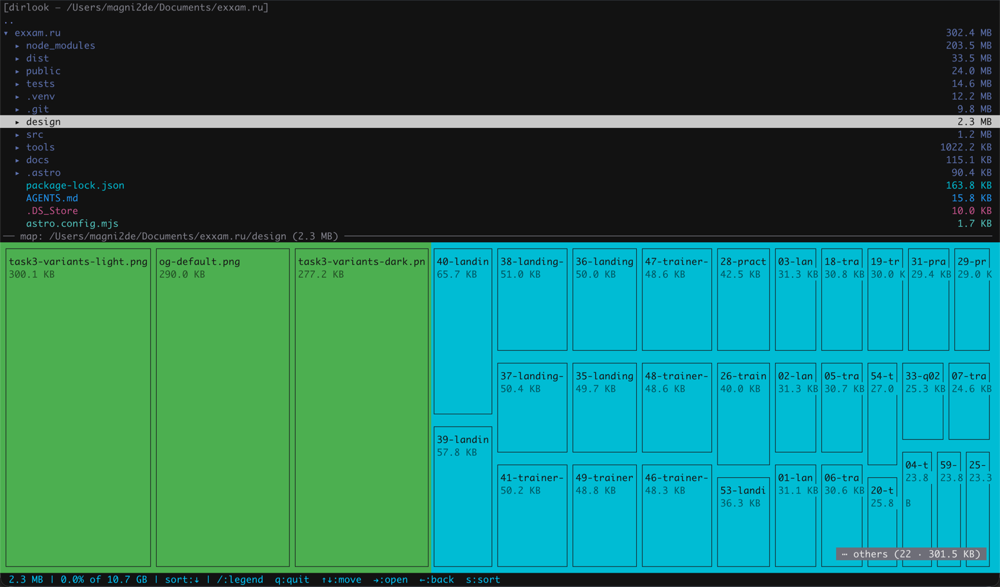
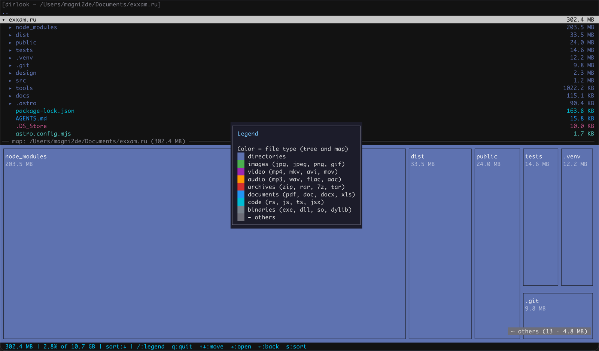

# dirlook

> A fast, zero-dependency terminal disk usage analyzer with a tree view and a
> WinDirStat-style treemap.



`dirlook` scans a directory and shows two synchronized views:

- a **tree** of folders and files with their sizes, and
- a **treemap** (a "data map") where every block's area is proportional to its
  size and colored by file type — just like WinDirStat.

No external crates and no config files: it is a single self-contained binary built
on the Rust standard library plus a small amount of POSIX FFI.

## Features

- **Tree view** with sizes, expand/collapse, and `Enter` to dive into a folder.
- **Squarified treemap** — blocks sized proportionally and colored by file type
  (images, video, audio, archives, documents, code, binaries, directories).
- **Color legend** toggled with `/`.
- **`⋯ others` chip** — tiny entries are aggregated, so the map never fills up
  with invisible specks.
- **Fast background scan** with a live progress screen: overall progress, a
  per-folder progress bar, running counters (directories / files / size) and
  elapsed time.
- **Instant navigation, no rescans** — the scanned tree is kept in memory, so
  `Enter` into a folder and going back up are immediate. Only going above the
  current root scans a new (parent) directory in the background.
- **Zero dependencies** — pure `std` + POSIX FFI (`termios`, `poll`, `ioctl`, `read`).
- **Double-buffered rendering** — only the cells that changed are redrawn, so the
  UI updates without flicker.

## Screenshots

Color legend (`/`):



## Install

### Prebuilt binaries

Download the archive for your platform from the
[Releases](https://github.com/magni2de/dirlook/releases) page, unpack it and put
`dirlook` somewhere on your `PATH`.

### From source

```sh
git clone https://github.com/magni2de/dirlook
cd dirlook
cargo build --release
# binary at target/release/dirlook
```

### With cargo

```sh
cargo install dirlook
```

## Usage

```
dirlook [OPTIONS] [PATH]
```

`PATH` is the directory to analyze (defaults to the current directory).

| Option | Description |
| --- | --- |
| `-h`, `--help` | Print help |
| `-V`, `--version` | Print version |

Running `dirlook` with no arguments analyzes the current directory.

## Keys

| Key | Action |
| --- | --- |
| `Up` / `Down`, `k` / `j` | Move the selection |
| `Right` | Expand / collapse a folder in the tree |
| `Enter` | Enter the selected folder (or go to the parent on `..`) |
| `Left`, `Backspace` | Collapse / move to the parent row |
| `s` | Toggle sort order |
| `/` | Toggle the color legend |
| `q` | Quit |

## How it works

- **Terminal** — raw mode via `cfmakeraw`, non-blocking input via `poll`, and
  single-byte reads straight from `fd 0`. The reads are unbuffered on purpose:
  going through the buffered standard input would swallow the whole escape
  sequence and hide the remaining bytes from `poll`, which makes a single arrow
  press look like a bare `Esc`.
- **Scanning** — the recursive walk runs on a background thread and publishes
  live counters and the current directory stack through atomics, so the UI keeps
  animating while it works.
- **Caching** — the scanned tree is kept in memory. Entering a folder or moving
  back up only changes which subtree is displayed; nothing is re-scanned.
- **Rendering** — a double-buffered screen emits only the changed cells each
  frame, and the app runs on the terminal's alternate screen.

## Platform support

| Platform | Status |
| --- | --- |
| macOS (arm64, x86_64) | Supported |
| Linux (x86_64, aarch64) | Supported |
| Windows | Not supported |

## License

Licensed under either of

- Apache License, Version 2.0 ([LICENSE-APACHE](LICENSE-APACHE))
- MIT license ([LICENSE-MIT](LICENSE-MIT))

at your option.

Unless you explicitly state otherwise, any contribution intentionally submitted
for inclusion in the work by you, as defined in the Apache-2.0 license, shall be
dual licensed as above, without any additional terms or conditions.
